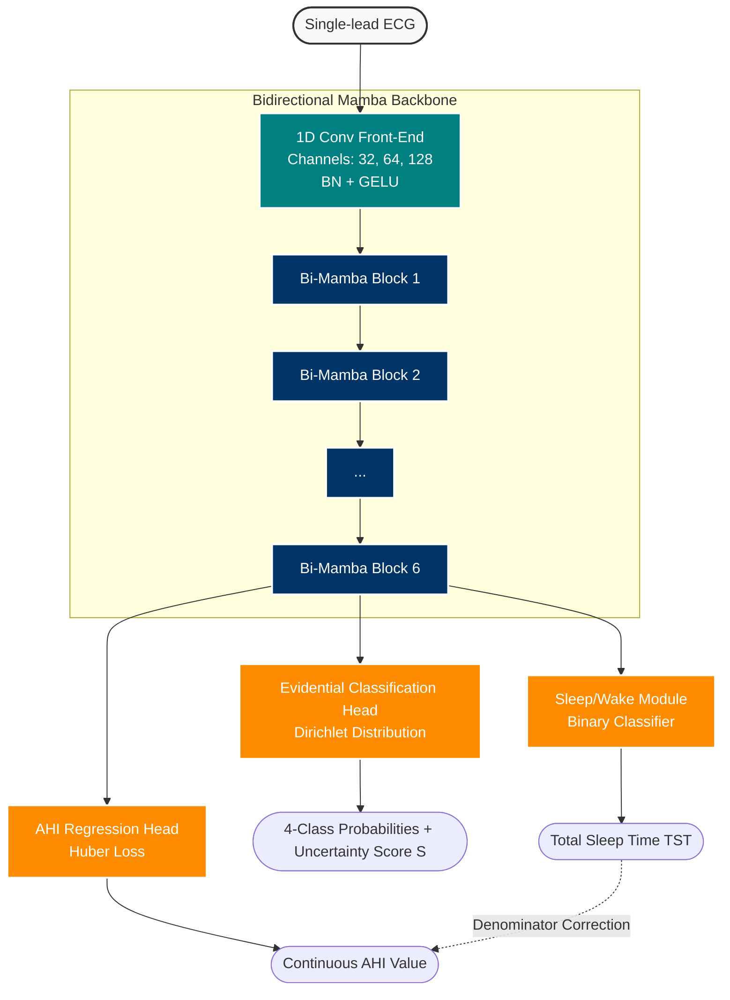
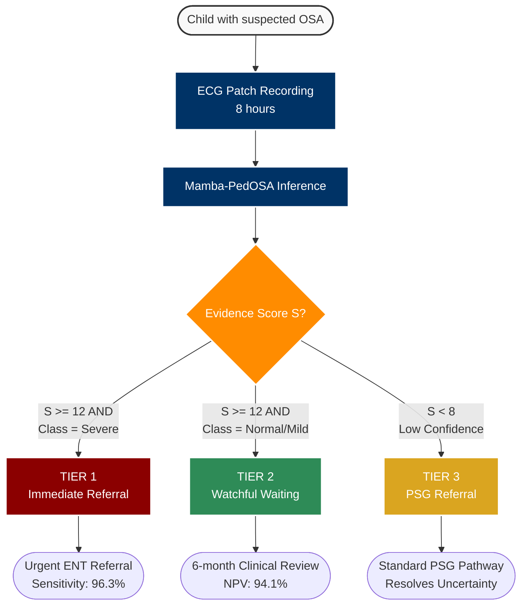

# Mamba-PedOSA Conceptual Diagrams

The following are the conceptual diagrams for Figures 1, 2, and 4, rendered using Mermaid.js. You can take screenshots of these to use in your paper, or use a Mermaid-to-PNG export tool.

## Figure 1: ECG Preprocessing Pipeline

```mermaid
graph LR
    A([Raw ECG Waveform]) -->|Artefacts & Noise| B[Bandpass Filter<br/>0.5-40 Hz]
    B --> C[R-peak Detector<br/>Pan-Tompkins]
    C --> D[Normalisation<br/>Zero Mean, Unit Variance]
    D --> E[Artefact Rejection<br/>Amplitude & Slope]
    E --> F([Clean 10-min Epochs])
    
    style A fill:#f9f9f9,stroke:#333,stroke-width:2px
    style B fill:#003366,stroke:#fff,stroke-width:2px,color:#fff
    style C fill:#003366,stroke:#fff,stroke-width:2px,color:#fff
    style D fill:#003366,stroke:#fff,stroke-width:2px,color:#fff
    style E fill:#003366,stroke:#fff,stroke-width:2px,color:#fff
    style F fill:#e6f7ff,stroke:#003366,stroke-width:2px
```

## Figure 2: Mamba-PedOSA Full Architecture Diagram

## Figure 4: Three-Tier Triage Workflow Flowchart

